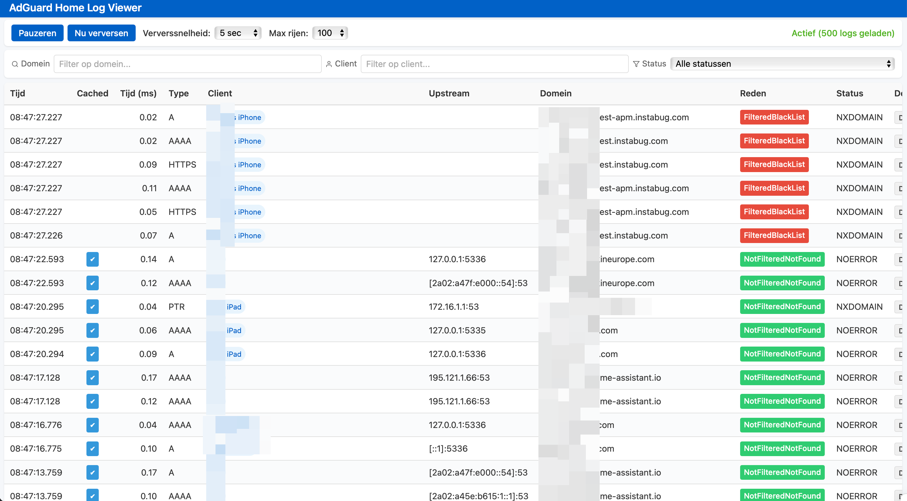

# AdGuard Log Viewer



AdGuard Log Viewer is a real-time log viewer for AdGuard Home (AGH) logs. It provides an intuitive UI to monitor your network traffic, highlight cache hits with a blue check mark, and display processing speed for each request.

---

## Features

- **Real-time log streaming**: View logs as they happen.
- **Cache hit indicator**: A blue ✔️ marks items served from cache.
- **Processing speed**: See how fast each request was handled.
- **Responsive UI**: Clean and easy to navigate.

---

## Prerequisites

- [Docker](https://www.docker.com/) installed on your system.
- A valid `.env` file in the project root with your AdGuard Home configuration.

---

## Installation

Clone the repository and navigate into it:

```bash
git clone git@github.com:spiralshapeturtle/aghlogviewer.git
cd aghlogviewer
```

---

## Build the Docker Image

Build the image with the following command:

```bash
docker build -t adguard-log-viewer .
```

---

## Run the Container

Stop any existing instance and start a new one:

```bash
docker rm -f logviewer || true

docker run -d \
  --name logviewer \
  -p 8080:3000 \
  --env-file .env \
  adguard-log-viewer
```

---

## Usage

Open your browser and go to:

```
http://localhost:8080
```

to see your AdGuard Home logs in real time.

---

## License

MIT License. See `LICENSE` for details.

